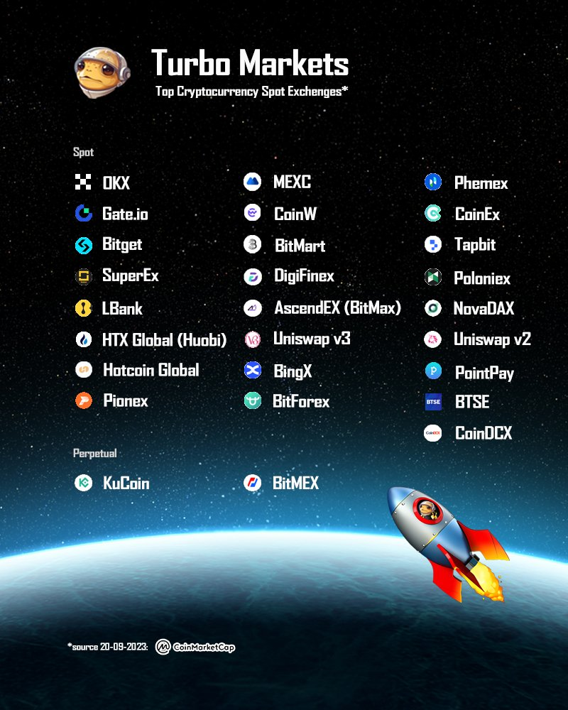

# 🚀 Welcome to Turbo DAO

## Official Contract Address

[0xA35923162C49cF95e6BF26623385eb431ad920D3](https://etherscan.io/token/0xa35923162c49cf95e6bf26623385eb431ad920d3)

## Genesis

$TURBO is a decentralized community powered by creativity and governed by AI. $TURBO believes in the potential of collective intelligence and the fusion of human creativity with artificial intelligence. We are a trailblazing community that operates on the principles of decentralization, enabling individuals from diverse backgrounds to come together and shape our future.

What sets $TURBO apart - other than being the very first AI-generated ERC20 and biggest meme experiment after $DOGE -  is our unique approach to governance.&#x20;

The $TURBO community formed an AI Oracle council, that comprises of seven dedicated volunteers who are elected by our community members. This council acts as a bridge between our community and our TURBOAI Chatbot, which serves as our guiding intelligence.

The AI Oracle council holds the responsibility of prompting the AI Chatbot, allowing us to tap into the vast knowledge and insights it possesses. Through this collaboration, we can harness the power of AI to make informed decisions and guide our community's direction. By involving both human creativity and AI intelligence, we strive to create a dynamic and innovative environment that pushes boundaries and drives us toward our collective goals.

**Our community is built on the principles of transparency, fairness, and inclusivity. We believe in giving every member an equal voice and opportunity to contribute. Whether you're an artist, a developer, an entrepreneur, or simply someone passionate about shaping the future, $TURBO welcomes you to join us in this groundbreaking journey.**

Together, we are forging new paths, exploring uncharted territories, and redefining what it means to be a community in the digital age. Join us at $TURBO and be a part of this extraordinary movement, where AI and human creativity converge to shape a brighter future for all.

## Our Values

Decentralization

We believe in the power of decentralization, where decision-making is distributed among community members. We value autonomy, empowerment, and the ability to collectively shape the future of $turbo.

Innovation

We foster a culture of innovation, pushing boundaries and exploring new frontiers. We encourage experimentation, creative thinking, and the pursuit of groundbreaking ideas that have the potential to make a positive impact.

Transparency

This is paramount in our community. We strive to maintain open lines of communication, ensuring that information, decisions, and processes are accessible and understandable to all. We value accountability and trust within our ecosystem.

<strong>Inclusivity</strong>

We are committed to inclusivity and believe that diverse perspectives drive progress. We embrace individuals from all backgrounds, cultures, and experiences. Everyone is welcome to contribute their unique talents and ideas to the $turbo community.

<strong>Collaboration</strong>

Collaboration is at the heart of our community. We believe in the power of collective intelligence, where individuals come together to share knowledge, support one another, and collaborate on projects that propel us forward.

<strong>Community Empowerment</strong>

We empower our community members to take an active role in shaping $TURBO. We provide opportunities for personal development, leadership, and active participation. Each member has the ability to contribute meaningfully and drive positive change.

## Official Links

* [Twitter](https://twitter.com/TurboToadToken) - _maintained by the Marketing Team_
* [Discord](https://discord.com/invite/My82XfxH8U) - _maintained by Operations Team_
* [Telegram](https://t.me/TurboToadToken) - _maintained by Marketing Team_
* [Messari](https://messari.io/asset/turbo-0) - _maintained by Marketing Team_
* [CoinGecko](https://www.coingecko.com/en/coins/turbo) - _maintained by Operations Team_
* [CoinMarketCap](https://coinmarketcap.com/currencies/turbo/) - _maintained by Operations Team_
* [Website](https://www.turbotoken.ai/) - _maintained by Operations Team_
* [Snapshot](https://snapshot.org/#/vote.turbocouncil.eth) - _maintained by Operations Team_
* [Docs](https://docs.turbotoken.ai/) - _maintained by Operations Team_
* [Gmail](mailto:community@turbotoadtoken.com?subject=Turbo%20Toad%20Enquiry) - _maintained by Operations Team_

## Buy & Sell $TURBO&#x20;

<figure><figcaption></figcaption></figure>

